# Sales-Ecommorce-Analysis

## Problem statement

Analyze the sales done by the store and find the insights on how to increase the sales. 

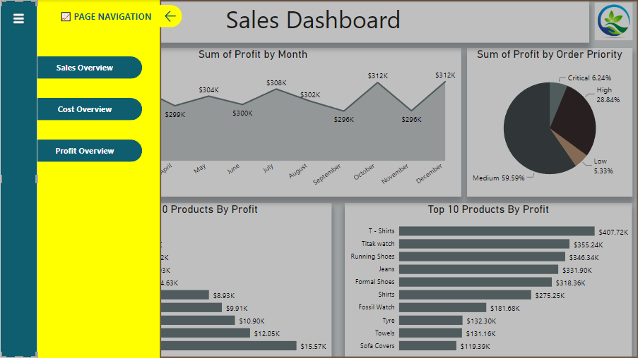

## Skills used

Used Power BI Desktop
1.	Power Query
2.	Power DAX
3.	Custom Column
4.	Merge Queries

## Data source

The sales dataset is downloaded from www.kaggle.com
It has two tables.
1.	Sales: It has the details of sales of products done by the store. There are 20 columns and 51,290 rows. Each row has the details of the customer who shopped from the store. The sales table contains the columns like Order ID, Order Date, Product name, Product Category, sales, Quantity etc. 
2.	Returns: The returns table has the information about the customers and products returned to the stores by the customers. It has 4 columns and 795 rows. The column names are Order ID, Customer Name, Returns and Sales Amount.

Sales table              |               Returns table
-------------------------|-------------------------------------
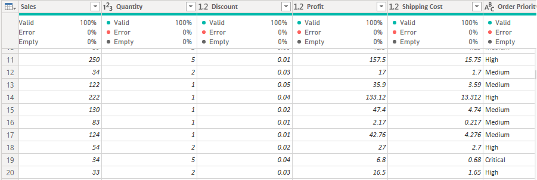           |               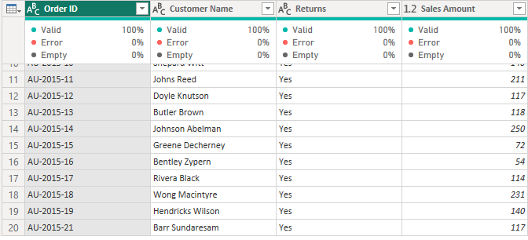

## Data modeling

Sales table and Returns table are joined by a common column ‘Order ID’. 

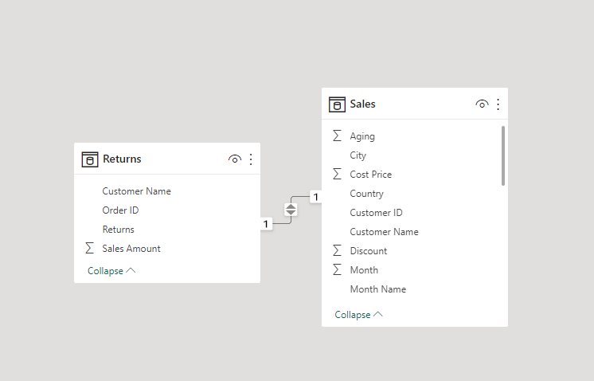

## Data transformation

The sales dataset is imported into Power Query for cleaning and to make the calculations necessary for the analysis and creating dashboard.
The Returns table has no errors, inconsistencies, nulls, empty characters and can be used for analysis and creating dashboard.
In Sales table, some calculations are made which are required for the analysis.
Added Total Sales, Selling Price, Cost Price columns using ‘Custom Column’ and changed their type to decimal number.

Formulae used to calculate 
```
Total Sales = [Sales]*[Quantity]
Selling Price = [Total Sales]*(1-[Discount])
Cost Price = [Selling Price]-[Profit]
```

‘Month Name’, ‘Month’ and ‘Quarter’ columns are extracted from the ‘Order Date’ column. ‘Month Name’ contains the names of all months when the customers made some purchases from the store. The ‘Month’ column is sorted in ascending order.

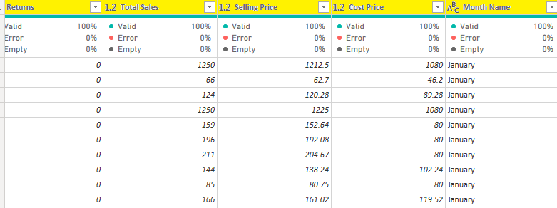

When ‘Cost Price’ column is sorted in ascending order, some values are found to be negative. 
About 1822 rows have negative cost price. So deleted those rows using ‘Remove top rows’.

Before                         |       After
-------------------------------|-----------------------------
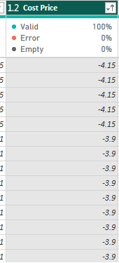	   |	 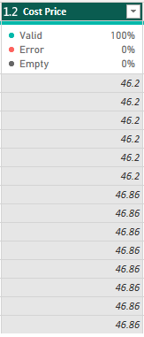

‘Returns’ column from the Returns table is added to the sales table by using ‘Merge Queries’.

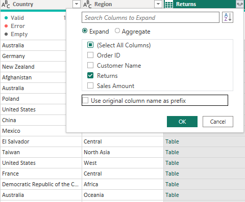

Then expanded the table to get all the columns. But as I wanted only returns column, so unchecked all columns except ‘Returns’. I then replaced ‘Yes’ with 1 and ‘null’ with 0 as this column contains only 795 rows with yes value and all other contains null.

## Analysis and Visualization

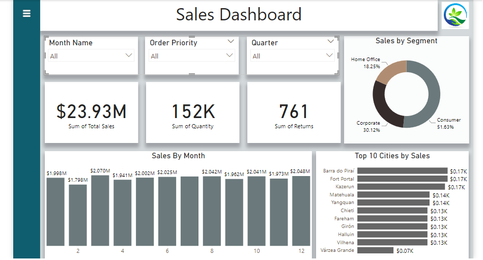

Store annual revenue for 2015 was $23.93 million; units sold 152K and count of products returned 761. More than 50% revenue was generated from consumer segment, about 30% from corporate and 18% from home office. 

March is the month with highest sales of $2.07M and New York is the city generating high revenue.

At the end first quarter, revenue generated is $5.87M, second $5.97M, third $6.04M and fourth $6.06M. Sales in first quarter were low due to fewer sales in February as compared to January and March.

Number of the products returned are 170 when priority is medium, 343 high, 248 critical and 0 when priority is low.

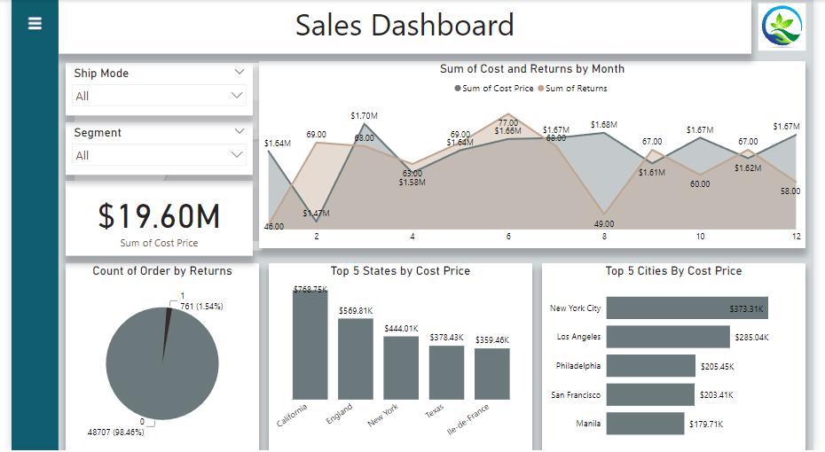

Store annual expenses for 2015 were $19.60M. The store made expenditure of $1.70M in March which is the highest of the year 2015 and $1.47M in February which is the lowest.

New York is the city which is spending the huge amount for the products and also the same city is generating high revenue among all other cities.

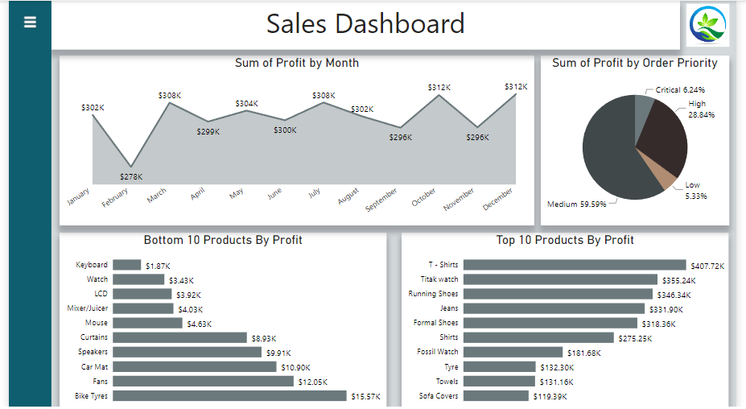

October and December are the months with highest profit of $312K. February is having the lowest profit of $278K.

The store is having about 60% profit when the order priority is medium and about 5% which is the lowest when priority is low.

The products which are not profitable to the store are keyboard, watch, LCD etc. T-shirts, jeans and shoes are the products by which the store is having the highest profits.

## Conclusions

- Cities like Vilhena, Varzea Grande and Fort Portal etc. are doing sales in the range of $70-$170 by the end of year which is not remarkable. Either they should offer discounts to the customers in order to increase their sales or else shut the stores in those cities to escape from bankruptcy.
- Number of products returned is high when the priority is high. February is the month with high returns and money spend in February is $1.47M which is the lowest of the year 2015. It may be due to the service they provide to the customers or quality of product might not be good. 
- Products like keyboard, watch, LCD etc. are the least profitable. So selling those can be avoided.


